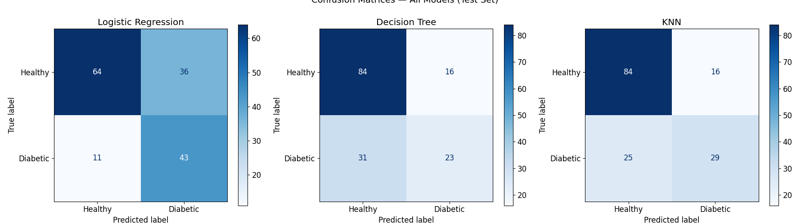
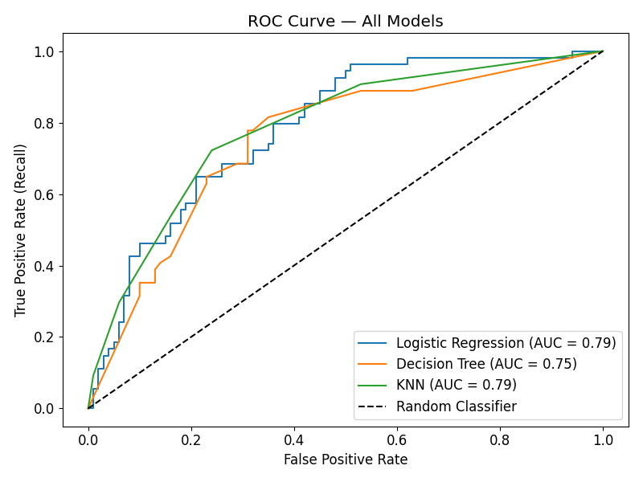
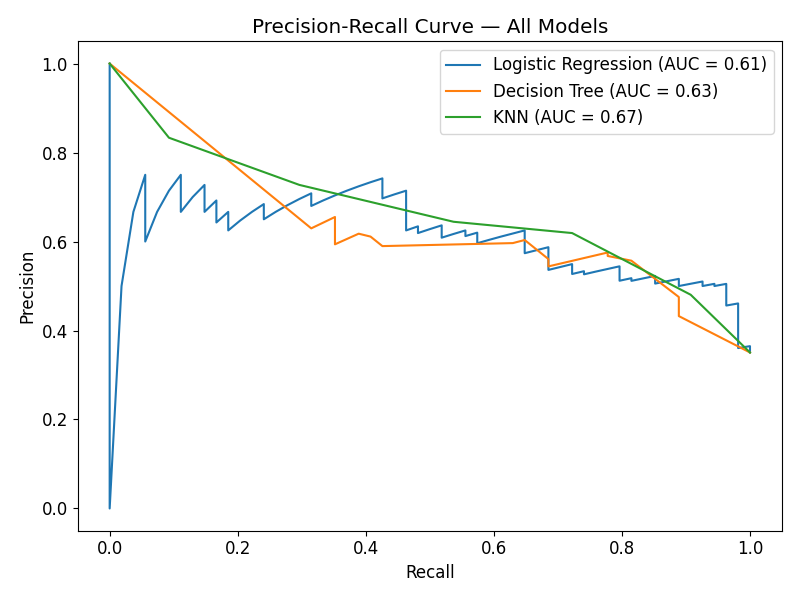
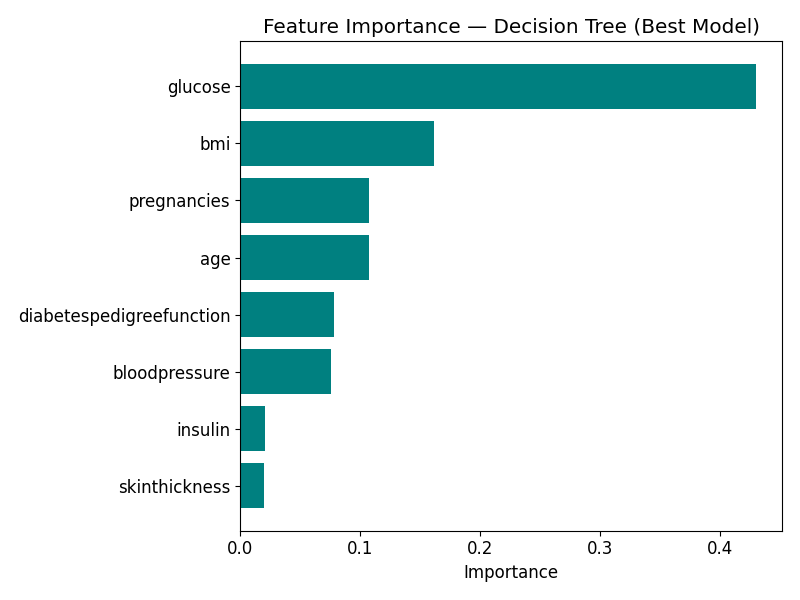

# 🩺 Diabetes Classification Project


A machine learning project to predict whether a patient has diabetes using the **Pima Indians Diabetes Database**. This project demonstrates a complete, production-quality ML pipeline — from raw data through cleaning, EDA, feature-specific preprocessing, model comparison, hyperparameter tuning, and evaluation.

---

## 📋 Table of Contents

- [Project Overview](#project-overview)
- [Dataset](#dataset)
- [Project Structure](#project-structure)
- [Notebook Walkthrough](#notebook-walkthrough)
- [Results](#results)
- [Key Visualisations](#key-visualisations)
- [How to Run](#how-to-run)
- [Tech Stack](#tech-stack)

---

## Project Overview

**Goal:** Binary classification — predict whether a patient tests positive for diabetes (`Outcome = 1`) or not (`Outcome = 0`).

**Why Recall?**  
Recall was chosen as the primary evaluation metric because in a medical context, a **false negative** (missing a diabetic patient) is far more dangerous than a false positive. Recall directly minimises this risk.

```
Recall = True Positives / (True Positives + False Negatives)
```

**Models compared:**
- Logistic Regression
- Decision Tree
- K-Nearest Neighbours (KNN)

All models were evaluated before and after hyperparameter tuning, with results compared using `plot_model_comparison()` — a reusable helper function defined at the top of the notebook.

---

## Dataset

- **Source:** [Kaggle — Pima Indians Diabetes Database](https://www.kaggle.com/datasets/uciml/pima-indians-diabetes-database)
- **Origin:** National Institute of Diabetes and Digestive and Kidney Diseases
- **Patients:** Females, at least 21 years old, of Pima Indian heritage
- **Size:** 768 observations, 8 features + 1 target

| Feature | Description |
|:---|:---|
| `Pregnancies` | Number of times pregnant |
| `Glucose` | Plasma glucose concentration (2h oral glucose tolerance test) |
| `BloodPressure` | Diastolic blood pressure (mm Hg) |
| `SkinThickness` | Triceps skin fold thickness (mm) |
| `Insulin` | 2-Hour serum insulin (mu U/ml) |
| `BMI` | Body mass index (kg/m²) |
| `DiabetesPedigreeFunction` | Genetic diabetes risk score |
| `Age` | Age in years |
| `Outcome` | 0 = Healthy, 1 = Diabetic *(target)* |

**Class balance:** ~65% healthy / ~35% diabetic — mild class imbalance addressed via `class_weight='balanced'` in Logistic Regression.

---

## Project Structure

```
diabetes-classification/
│
├── data/
│   └── diabetes.csv
│
├── images/
│   ├── Recall & Accuracy: Train vs Test (After GridSearchCV).png
│   ├── confusion_matrices_all.png
│   ├── roc_curve.png
│   ├── precision_recall_curve.png
│   └── feature_importance.png
│
├── diabetes_classification.ipynb
├── README.md
└── .gitignore
```

---

## Notebook Walkthrough

The notebook follows a deliberate 18-step structure. Each step answers a specific question and builds directly on the previous one.

| Step | Section | Question answered |
|:---:|:---|:---|
| 1 | Imports | What libraries are needed? |
| 2 | Helper Functions | What reusable functions will we use throughout? |
| 3 | Load Data | What does the raw data look like? |
| 4 | Exploration & Cleaning | Are there invalid values that need fixing? |
| 5 | Train-Test Split | How do we prevent data leakage from the start? |
| 6 | Outlier Removal | Are there outliers in the training data? |
| 7 | EDA | Which features correlate most with the target? |
| 8 | Baseline Model | What is our performance floor? |
| 9 | Skewness Analysis | Which scaler is appropriate for each feature? |
| 10 | Feature-Specific Pipeline | How do we apply the right transformation per feature? |
| 11 | Before vs After Comparison | Does feature-specific scaling improve results? |
| 12 | Cross-Validation (No Tuning) | What is our pre-tuning baseline across all 3 models? |
| 13 | GridSearchCV Tuning | What are the best hyperparameters for each model? |
| 14 | Final Test Evaluation | How do tuned models perform on unseen data? |
| 15 | Confusion Matrices | Where does each model make mistakes? |
| 16 | ROC Curve | How well does each model distinguish classes? |
| 17 | Precision-Recall Curve | How does each model balance precision vs recall? |
| 18 | Feature Importance | Which features drive the Decision Tree's predictions? |

---

### Key Design Decisions

**1. Data leakage prevention**  
The train-test split is performed before any preprocessing. Outlier removal bounds, imputation values, and scaler parameters are all computed exclusively from training data. The test set is always passed raw into the pipeline — preprocessing is handled internally.

**2. Feature-specific scaling**  
Rather than applying a single scaler to all features, skewness analysis (Step 9) was used to assign the most appropriate transformation per feature group:

| Feature Group | Features | Scaler |
|:---|:---|:---|
| Symmetric | glucose, bloodpressure, bmi, skinthickness | `StandardScaler` |
| Skewed | insulin, diabetespedigreefunction | `PowerTransformer` (yeo-johnson) |
| Count-based | pregnancies, age | `RobustScaler` |

**3. Overfitting guard in comparison steps**  
`DecisionTreeClassifier` is capped at `max_depth=5` in Steps 11 and 12 to prevent train recall of 1.0 from distorting the comparison charts. GridSearchCV in Step 13 searches `max_depth` freely from `[3, 5, 7]`.

**4. Fresh preprocessors per step**  
Sklearn transformers carry fitted state. Before Steps 11 and 12, preprocessors are redefined with a clean (unfitted) state to ensure each pipeline gets a fresh fit. This avoids subtle bugs from reusing already-fitted objects.

**5. sklearn Pipelines throughout**  
All preprocessing and modelling steps are encapsulated in `Pipeline` objects, ensuring reproducibility, preventing leakage across CV folds, and making the code production-ready.

**6. Reusable helper functions**  
All plotting and utility functions (`remove_outliers`, `hist_plot`, `plot_target_correlation`, `plot_model_comparison`) are defined in Step 2 and reused throughout — keeping the notebook clean and DRY.

---

## Results

### Baseline (Step 8) — Glucose only, uniform StandardScaler

| Metric | Score |
|:---|:---:|
| Accuracy | 0.76 |
| Recall | 0.48 |
| Precision | 0.69 |

### Cross-Validation Before Tuning (Step 12)

| Model | Mean CV Recall | Std |
|:---|:---:|:---:|
| Logistic Regression | 0.54 | 0.08 |
| Decision Tree | 0.55 | 0.11 |
| KNN | 0.57 | 0.06 |

### After GridSearchCV Tuning (Step 14)

| Model | Train Recall | Test Recall | Train Accuracy | Test Accuracy |
|:---|:---:|:---:|:---:|:---:|
| Logistic Regression | 0.54 | 0.80 | 0.78 | 0.69 |
| Decision Tree | 0.55 | 0.43| 0.75 | 0.69 |
| KNN | 0.57 | 0.54 | 0.76 | 0.73 |

> *Run the notebook to populate these tables with actual results.*

**Key finding:** Logistic Regression with `class_weight='balanced'` achieved the best test recall — confirming that directly addressing class imbalance is more impactful than scaling choices alone for improving recall on this dataset.

---

## Key Visualisations


### Confusion Matrices — All Models (Step 15)


### ROC Curve — All Models (Step 16)


### Precision-Recall Curve — All Models (Step 17)


### Feature Importance — Decision Tree (Step 18)


---

## Set up your Environment

Please make sure you have forked the repo and set up a new virtual environment. For this purpose you can use the following commands:

The added [requirements file](requirements.txt) contains all libraries and dependencies we need to execute the Diabetes Challenge notebooks.

*Note: If there are errors during environment setup, try removing the versions from the failing packages in the requirements file. M1 shizzle.*

### **`macOS`** type the following commands : 

- We have also added a [Makefile](Makefile) which has the recipe called 'setup' which will run all the commands for setting up the environment.
Feel free to check and use if you are tired of copy pasting so many commands.

     ```BASH
    make setup
    ```
    After that active your environment by following commands:
    ```BASH
    source .venv/bin/activate
    ```
Or ....
- Install the virtual environment and the required packages by following commands:

    ```BASH
    pyenv local 3.11.3
    python -m venv .venv
    source .venv/bin/activate
    pip install --upgrade pip
    pip install -r requirements.txt
    ```
    
### **`WindowsOS`** type the following commands :

- Install the virtual environment and the required packages by following commands.

   For `PowerShell` CLI :

    ```PowerShell
    pyenv local 3.11.3
    python -m venv .venv
    .venv\Scripts\Activate.ps1
    python -m pip install --upgrade pip
    pip install -r requirements.txt
    ```

    For `Git-bash` CLI :
  
    ```BASH
    pyenv local 3.11.3
    python -m venv .venv
    source .venv/Scripts/activate
    python -m pip install --upgrade pip
    pip install -r requirements.txt
    ```

    **`Note:`**
    If you encounter an error when trying to run `pip install --upgrade pip`, try using the following command:
    ```Bash
    python.exe -m pip install --upgrade pip

---

## Tech Stack

| Tool | Purpose |
|:---|:---|
| `pandas` / `numpy` | Data manipulation and numerical computing |
| `matplotlib` / `seaborn` | Visualisation |
| `scikit-learn` | Preprocessing, modelling, hyperparameter tuning, evaluation |
| `Jupyter Notebook` | Interactive development environment |

---

## 👤 Author

**Pratik Kalsariya**  
[LinkedIn](https://www.linkedin.com/in/pratikkalsariya/) · [GitHub](https://github.com/PratikKalsariya)
